# Wireshark Questions 3
1. `np.hma.rocks`: `5.62.63.44`
2. Oxford University name server: `raptor.dns.ox.ac.uk`
3. `raptor.dns.ox.ac.uk` timed out and did not send a response.
4. They are sent over UDP

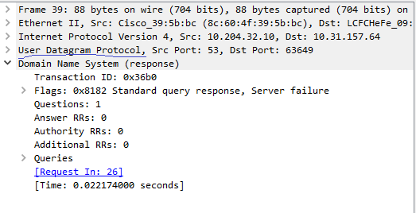

5. Port 53

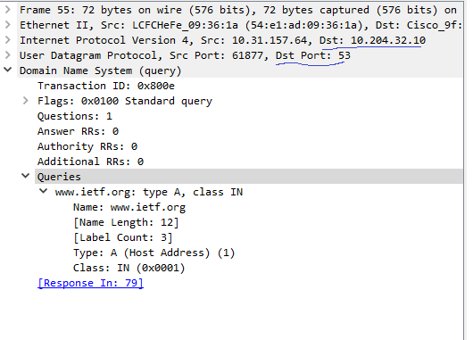

6. `10.204.32.10`. Yes, they are the same
7. Type: A. The query does not contain any answers.
8. There were multiple responses. The first response contains 1 answer that contains several IPs where `www.ietf.org` can be reached. The second response contains 2 answers.

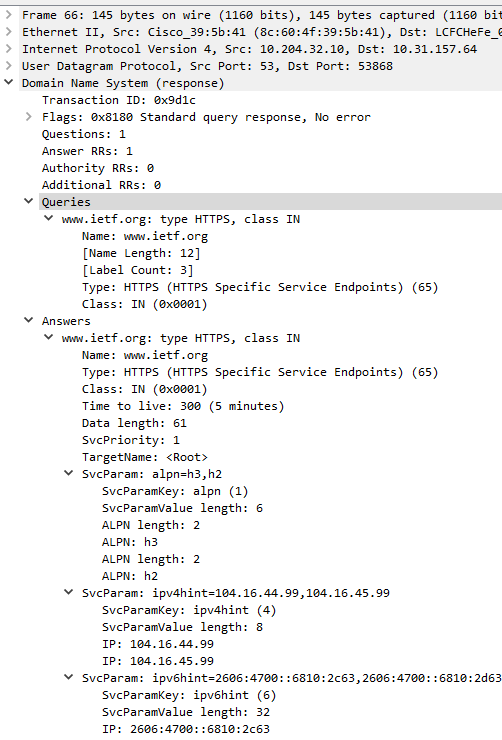
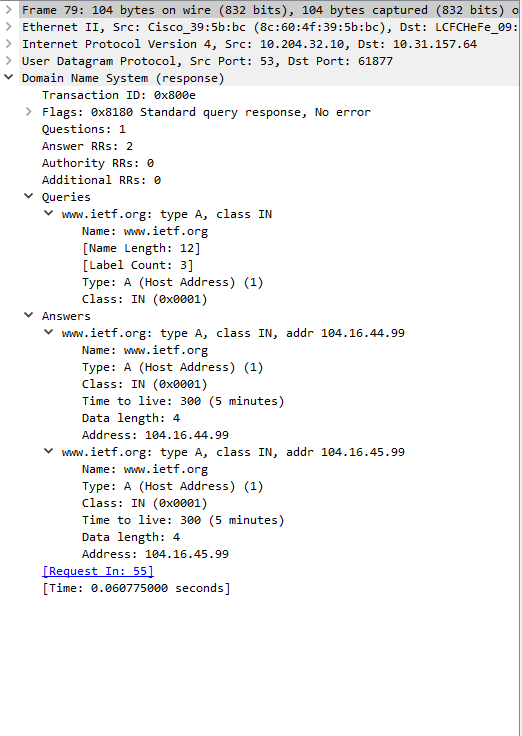

9. The destination of most of the SYN packets is the IP of `www.ietf.org` itself.

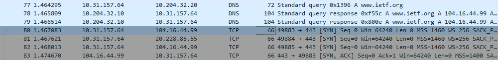

10. No
11. Source: `10.31.157.64`, Dest: `10.204.32.10`

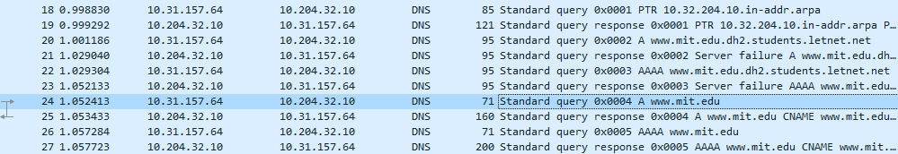

12. Yes, it is the IP address of my local DNS server.
13. It is type A, and it does not contain answers.

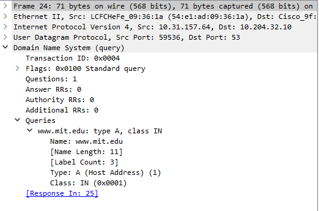

14. The response contains 3 answers. 2 answers contain alternate names for this domain. 1 contains an address where it can be accessed.

15. 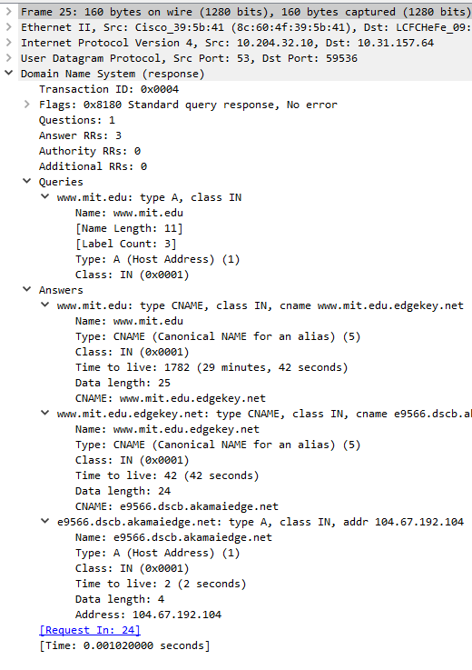
16. The DNS query was again sent to `10.204.32.10`, my local DNS server.
17. This query has type NS, and it does not contain any answers.
18. The response lists out 8 MIT nameservers, `eur5.akam.net`, `asia1.akam.net`, `ns1-173.akam.net`, `use2.akam.net`, `ns1-31.akam.net`, `use5.akam.net`, `asia2.akam.net`, and `usw2.akam.net`. It also has "Additional records" telling me the IP address of each of those servers. 
19. 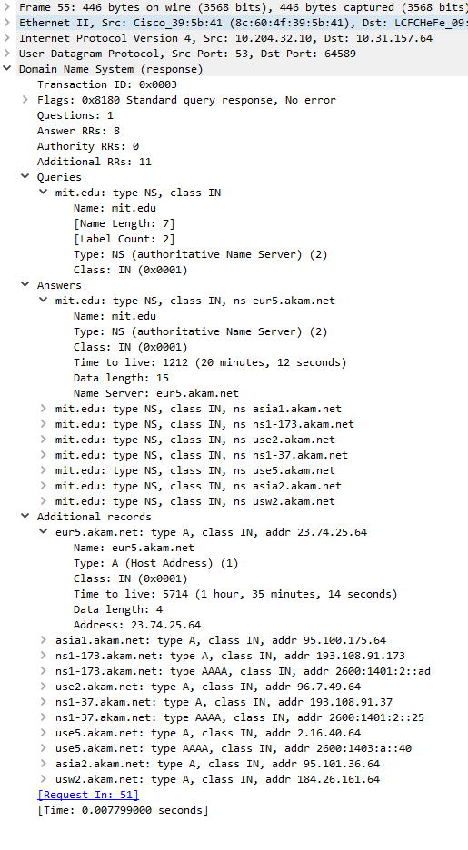

Note: `bitsy.mit.edu` timed out, so I used the downloaded trace.
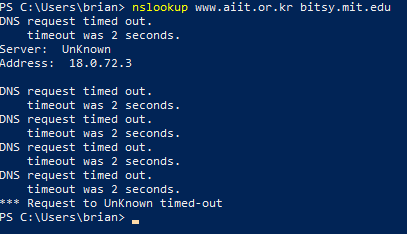

20. The DNS query is sent to `18.72.0.3`. I suspect that this was the DNS server, `bitsy.mit.edu` when this trace was made. In the image above, it is `18.0.72.3`.
21. The query is type A and does not contain any answers.

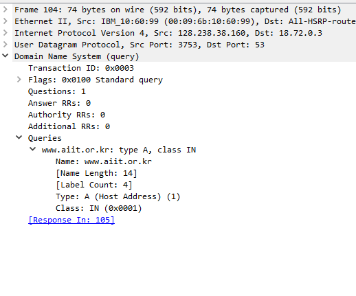

22. There is 1 answer, 2 authoritative nameservers, and 2 additional records. The answer is the IP we were searching for. I would guess that the Authoritative nameservers and Additional records sections are just an indicator that we could have used a different DNS server.
23. 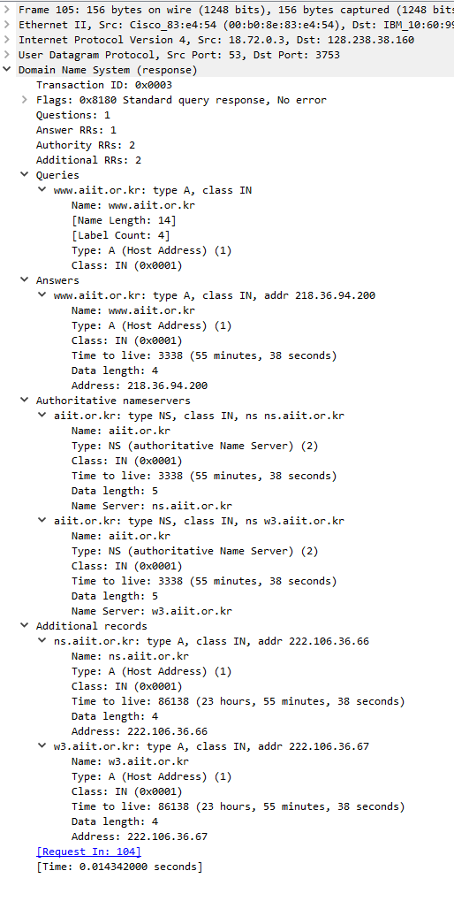
