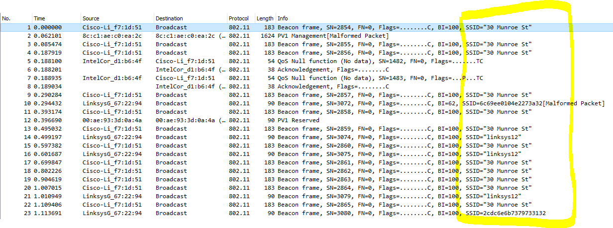
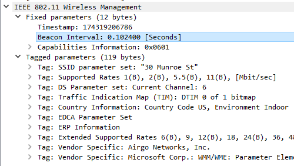
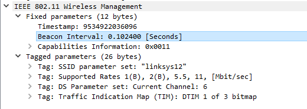
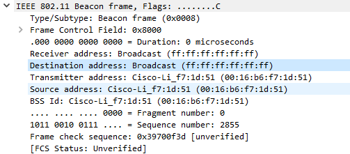
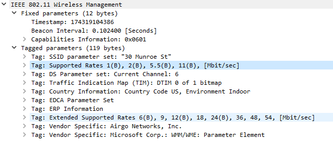
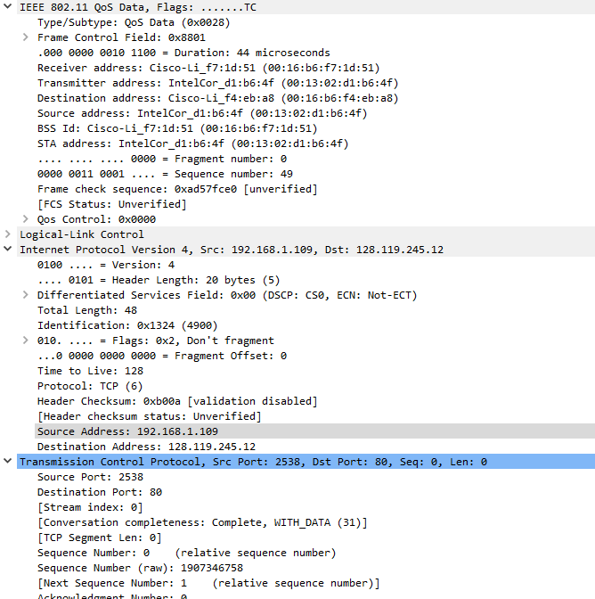
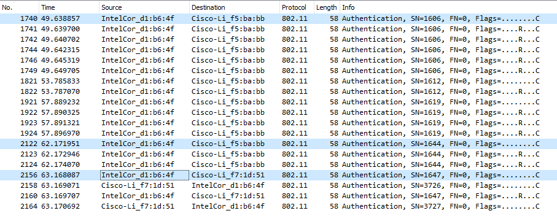
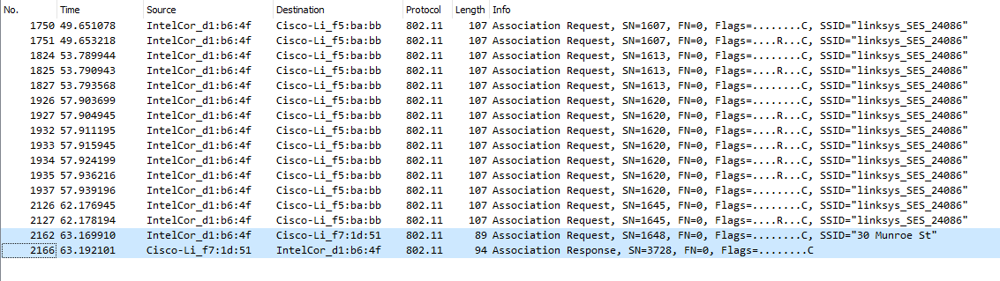
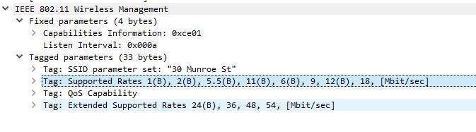
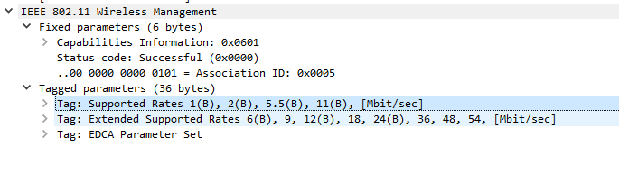

# Wireshark 802.11 Questions
1. "30 Munroe St" and "linksys12"

2. Both have a Beacon Interval of 1024ms

3. `00:16:b6:f7:1d:51`
4. `ff:ff:ff:ff:ff:ff`
5. `00:16:b6:f7:1d:51`

6. The supported rates are 1, 2, 5.5, and 11 Mbps, and the extended supported rates are 6, 9, 12, 18, 24, 36, 48, and 54 Mbps.

7. Question 7
   * The wireless host is the Source Address: `00:13:02:d1:b6:4f`.
   * The access point is the Receiver Address: `00:16:b6:f7:1d:51`.
   * The first-hop router is the Destination Address: `00:16:b6:f4:eb:a8`.
   * The host IP address is the Source Address: `192.168.1.109`.
   * The destination IP address is `128.119.245.12`.
   * The destination address is the address of gaia.cs.umass.edu.

8. Question 8
   * The wireless host is the Destination Address: `91:2a:b0:49:b6:4f`.
   * The access point is the Transmitter Address: `00:16:b6:f7:1d:51`
   * The first-hop router is the Source Address: `00:16:b6:f4:eb:a8`
   * The sender MAC address in the frame corresponds to the first-hop router, not the device that sent the TCP segment. 

9. First the host releases its IP address, then it Deauthenticates. I would expect to also see some kind of disassociation frame. 

10. 6 authentication frames are sent from the host to the *linksys* AP.
11. The host wants the authentication to be open.
12. No, there is no reply from *linksys*.
13. The Authentication frame to *30 Munroe St* is sent at *t = 62.171951*, and the response comes at *t = 63.169071*.

14. The associate request is sent at *t = 63.169910*, and the response is received at *t = 63.192101*.

15. The host can support rates of 1, 2, 5.5, 11, 6, 9, 12, 18, 24, 36, 48, and 54 Mbps. The AP can support rates of 1, 2, 5.5, 11, 6, 9, 12, 18, 24, 36, 48, and 54 Mbps.

16. In the Probe Request frames, the Source is ourselves, `IntelCor_d1:b6:4f`, and the Receiver and BSS Id are `ff:ff:ff:ff:ff:ff`. In the Probe response, the Source and BSS Id are the MAC address of the *30 Munroe St* AP, `Cisco-Li_f7:1d:51`, and the Receiver is our address. The purpose of these frames is to request a beacon frame.
