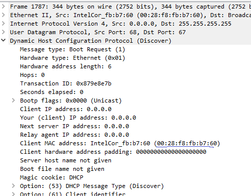
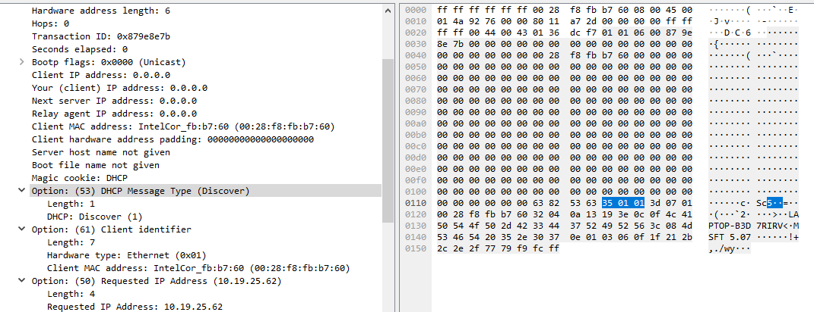
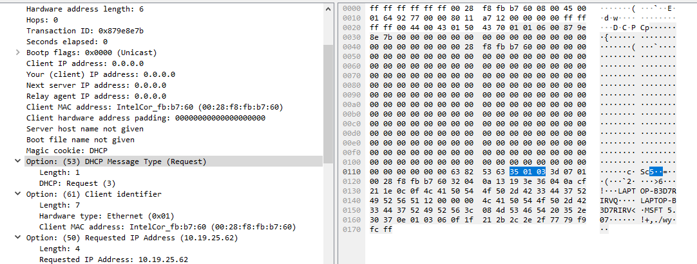
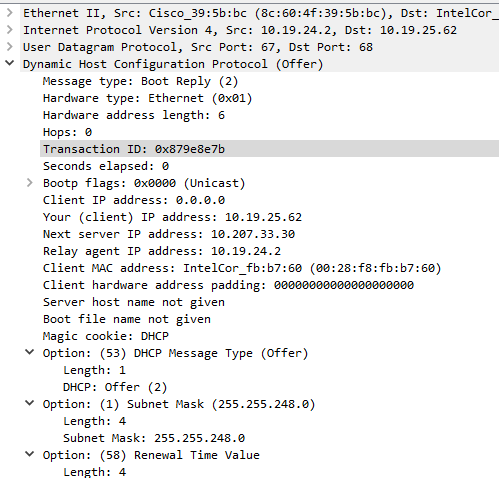
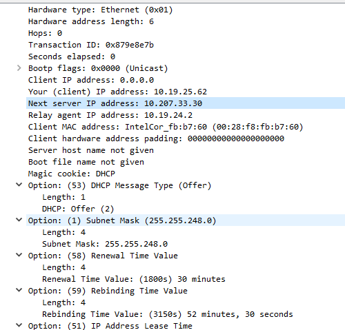
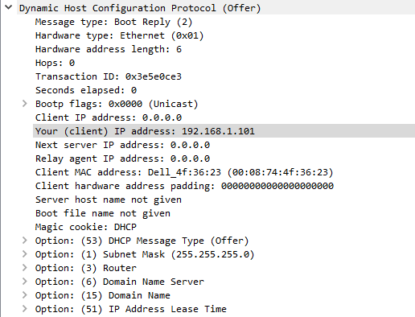
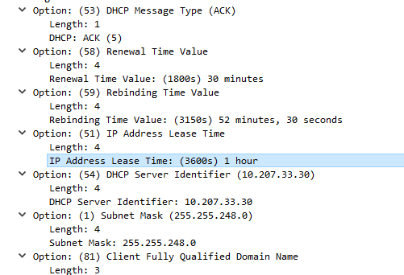
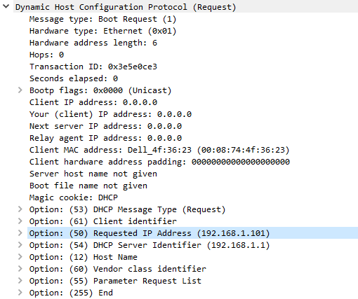

# Wireshark Questions DHCP
1. DHCP messages are sent over UDP.
2. The example does not show the port number, but id used the same protocol (DHCP), so I would guess it's the same port numebrs. Timing diagram:

```
+-----------------------------------+
| Discover                          |
| From: 0.0.0.0:68 (me)             |
| To: 255.255.255.255:67 (everyone) |
+-----------------------------------+
| 733.907ms                         |
+-----------------------------------+
| Offer                             |
| From: 10.19.24.2:67 (DHCP server) |
| To: 10.19.25.63:68                |
+-----------------------------------+
| 0.62ms                            |
+-----------------------------------+
| Request                           |
| From: 0.0.0.0:68 (me)             |
| To: 255.255.255.255:67 (everyone) |
+-----------------------------------+
| 8.138ms                           |
+-----------------------------------+
| ACK                               |
| From: 10.19.24.2:67 (DHCP server) |
| To: 10.19.25.62 (me)              |
+-----------------------------------+
```
3. My MAC address is `00:28:f8:fb:b7:60`.



4. Option 53 differentiates Discover from Request.




5. Transaction IDs
   1. Discover: `0x879e8e7b`
   2. Offer: `0x879e8e7b`
   3. Request: `0x879e8e7b`
   4. ACK: `0x879e8e7b`
6. In messages my host sends to the DHCP server, I use source = `0.0.0.0` and dest = `255.255.255.255`. For messages the DHCP server sends to me, it uses its own IP (`10.19.24.2`) for the source and the IP in question (in this case, `10.19.25.62`) as the dest. 
7. See #6.
8. The DHCP server offers me `10.19.25.62` in the Offer message.



9. There is no Relay Agent because the Relay agent IP address is `0.0.0.0`. In my case, there is a Relay agent at `10.19.24.2`.
10. The router line tells me the IP of the router, and the subnet mask line tells me the subnet in which this IP address resides. 



11. Yes, the client requests the same IP address that the server offered (`192.168.1.101`).



12. The lease time is the amount of time I get to have this IP address. In my case, I have a lease time of 1 hour.




13. The Release message tells the DHCP server that I'm done with this IP and it can be assigned to someone else. If this Release message were lost, then my lease will run out in an hour, and the IP could be given to someone else. Or if I rejoin and send out another Discover message, then the DHCP server will probably see that I have the same MAC address as the person that currently is leasing the IP and just give me the same IP. 
14. There is a broadcast (named, `ARP Announcement for 169.254.119.224` in Wireshark) sent by my MAC address between Discover and Offer, but it seems unrelated. There are a lot of ARP messages sent after ACK though, like getting the MAC address for the router and querying the MAC address connected to the IP address I just got. I guess it just wants to make sure no one is using the IP before it uses it. 

# Powershell Output
I have many network adapters, so all the output would not fit on one screenshot. Here it is:
```
PS C:\Users\brian> ipconfig /release

Windows IP Configuration

No operation can be performed on Ethernet while it has its media disconnected.
No operation can be performed on Local Area Connection* 3 while it has its media disconnected.
No operation can be performed on Bluetooth Network Connection while it has its media disconnected.

Ethernet adapter Ethernet:

   Media State . . . . . . . . . . . : Media disconnected
   Connection-specific DNS Suffix  . : dh2.students.letnet.net

Ethernet adapter vEthernet (WSL):

   Connection-specific DNS Suffix  . :
   Link-local IPv6 Address . . . . . : fe80::645e:ea7f:1aeb:d878%68
   IPv4 Address. . . . . . . . . . . : 172.24.128.1
   Subnet Mask . . . . . . . . . . . : 255.255.240.0
   Default Gateway . . . . . . . . . :

Ethernet adapter VirtualBox Host-Only Network:

   Connection-specific DNS Suffix  . :
   Link-local IPv6 Address . . . . . : fe80::9277:34e8:42c3:ce63%3
   IPv4 Address. . . . . . . . . . . : 192.168.56.1
   Subnet Mask . . . . . . . . . . . : 255.255.255.0
   Default Gateway . . . . . . . . . :

Wireless LAN adapter Local Area Connection* 3:

   Media State . . . . . . . . . . . : Media disconnected
   Connection-specific DNS Suffix  . :

Wireless LAN adapter Wi-Fi:

   Connection-specific DNS Suffix  . :
   Link-local IPv6 Address . . . . . : fe80::1b1b:a96c:f1df:a40a%20
   Default Gateway . . . . . . . . . :

Ethernet adapter Bluetooth Network Connection:

   Media State . . . . . . . . . . . : Media disconnected
   Connection-specific DNS Suffix  . :
PS C:\Users\brian> ipconfig /renew

Windows IP Configuration

No operation can be performed on Ethernet while it has its media disconnected.
No operation can be performed on Local Area Connection* 3 while it has its media disconnected.
No operation can be performed on Bluetooth Network Connection while it has its media disconnected.

Ethernet adapter Ethernet:

   Media State . . . . . . . . . . . : Media disconnected
   Connection-specific DNS Suffix  . : dh2.students.letnet.net

Ethernet adapter vEthernet (WSL):

   Connection-specific DNS Suffix  . :
   Link-local IPv6 Address . . . . . : fe80::aeb8:ef74:6a07:8fe1%68
   IPv4 Address. . . . . . . . . . . : 172.24.128.1
   Subnet Mask . . . . . . . . . . . : 255.255.240.0
   Default Gateway . . . . . . . . . :

Ethernet adapter VirtualBox Host-Only Network:

   Connection-specific DNS Suffix  . :
   Link-local IPv6 Address . . . . . : fe80::9277:34e8:42c3:ce63%3
   IPv4 Address. . . . . . . . . . . : 192.168.56.1
   Subnet Mask . . . . . . . . . . . : 255.255.255.0
   Default Gateway . . . . . . . . . :

Wireless LAN adapter Local Area Connection* 3:

   Media State . . . . . . . . . . . : Media disconnected
   Connection-specific DNS Suffix  . :

Wireless LAN adapter Wi-Fi:

   Connection-specific DNS Suffix  . : wireless.letnet.net
   Link-local IPv6 Address . . . . . : fe80::1b1b:a96c:f1df:a40a%20
   IPv4 Address. . . . . . . . . . . : 10.19.25.62
   Subnet Mask . . . . . . . . . . . : 255.255.248.0
   Default Gateway . . . . . . . . . : 10.19.24.1

Ethernet adapter Bluetooth Network Connection:

   Media State . . . . . . . . . . . : Media disconnected
   Connection-specific DNS Suffix  . :
PS C:\Users\brian> ipconfig /renew

Windows IP Configuration

No operation can be performed on Ethernet while it has its media disconnected.
No operation can be performed on Local Area Connection* 3 while it has its media disconnected.
No operation can be performed on Bluetooth Network Connection while it has its media disconnected.

Ethernet adapter Ethernet:

   Media State . . . . . . . . . . . : Media disconnected
   Connection-specific DNS Suffix  . : dh2.students.letnet.net

Ethernet adapter vEthernet (WSL):

   Connection-specific DNS Suffix  . :
   Link-local IPv6 Address . . . . . : fe80::645e:ea7f:1aeb:d878%68
   IPv4 Address. . . . . . . . . . . : 172.24.128.1
   Subnet Mask . . . . . . . . . . . : 255.255.240.0
   Default Gateway . . . . . . . . . :

Ethernet adapter VirtualBox Host-Only Network:

   Connection-specific DNS Suffix  . :
   Link-local IPv6 Address . . . . . : fe80::9277:34e8:42c3:ce63%3
   IPv4 Address. . . . . . . . . . . : 192.168.56.1
   Subnet Mask . . . . . . . . . . . : 255.255.255.0
   Default Gateway . . . . . . . . . :

Wireless LAN adapter Local Area Connection* 3:

   Media State . . . . . . . . . . . : Media disconnected
   Connection-specific DNS Suffix  . :

Wireless LAN adapter Wi-Fi:

   Connection-specific DNS Suffix  . : wireless.letnet.net
   Link-local IPv6 Address . . . . . : fe80::1b1b:a96c:f1df:a40a%20
   IPv4 Address. . . . . . . . . . . : 10.19.25.62
   Subnet Mask . . . . . . . . . . . : 255.255.248.0
   Default Gateway . . . . . . . . . : 10.19.24.1

Ethernet adapter Bluetooth Network Connection:

   Media State . . . . . . . . . . . : Media disconnected
   Connection-specific DNS Suffix  . :
PS C:\Users\brian> ipconfig /release

Windows IP Configuration

No operation can be performed on Ethernet while it has its media disconnected.
No operation can be performed on Local Area Connection* 3 while it has its media disconnected.
No operation can be performed on Bluetooth Network Connection while it has its media disconnected.

Ethernet adapter Ethernet:

   Media State . . . . . . . . . . . : Media disconnected
   Connection-specific DNS Suffix  . : dh2.students.letnet.net

Ethernet adapter vEthernet (WSL):

   Connection-specific DNS Suffix  . :
   Link-local IPv6 Address . . . . . : fe80::645e:ea7f:1aeb:d878%68
   IPv4 Address. . . . . . . . . . . : 172.24.128.1
   Subnet Mask . . . . . . . . . . . : 255.255.240.0
   Default Gateway . . . . . . . . . :

Ethernet adapter VirtualBox Host-Only Network:

   Connection-specific DNS Suffix  . :
   Link-local IPv6 Address . . . . . : fe80::9277:34e8:42c3:ce63%3
   IPv4 Address. . . . . . . . . . . : 192.168.56.1
   Subnet Mask . . . . . . . . . . . : 255.255.255.0
   Default Gateway . . . . . . . . . :

Wireless LAN adapter Local Area Connection* 3:

   Media State . . . . . . . . . . . : Media disconnected
   Connection-specific DNS Suffix  . :

Wireless LAN adapter Wi-Fi:

   Connection-specific DNS Suffix  . :
   Link-local IPv6 Address . . . . . : fe80::1b1b:a96c:f1df:a40a%20
   Default Gateway . . . . . . . . . :

Ethernet adapter Bluetooth Network Connection:

   Media State . . . . . . . . . . . : Media disconnected
   Connection-specific DNS Suffix  . :
PS C:\Users\brian> ipconfig /renew

Windows IP Configuration

No operation can be performed on Ethernet while it has its media disconnected.
No operation can be performed on Local Area Connection* 3 while it has its media disconnected.
No operation can be performed on Bluetooth Network Connection while it has its media disconnected.

Ethernet adapter Ethernet:

   Media State . . . . . . . . . . . : Media disconnected
   Connection-specific DNS Suffix  . : dh2.students.letnet.net

Ethernet adapter vEthernet (WSL):

   Connection-specific DNS Suffix  . :
   Link-local IPv6 Address . . . . . : fe80::645e:ea7f:1aeb:d878%68
   IPv4 Address. . . . . . . . . . . : 172.24.128.1
   Subnet Mask . . . . . . . . . . . : 255.255.240.0
   Default Gateway . . . . . . . . . :

Ethernet adapter VirtualBox Host-Only Network:

   Connection-specific DNS Suffix  . :
   Link-local IPv6 Address . . . . . : fe80::9277:34e8:42c3:ce63%3
   IPv4 Address. . . . . . . . . . . : 192.168.56.1
   Subnet Mask . . . . . . . . . . . : 255.255.255.0
   Default Gateway . . . . . . . . . :

Wireless LAN adapter Local Area Connection* 3:

   Media State . . . . . . . . . . . : Media disconnected
   Connection-specific DNS Suffix  . :

Wireless LAN adapter Wi-Fi:

   Connection-specific DNS Suffix  . : wireless.letnet.net
   Link-local IPv6 Address . . . . . : fe80::1b1b:a96c:f1df:a40a%20
   IPv4 Address. . . . . . . . . . . : 10.19.25.62
   Subnet Mask . . . . . . . . . . . : 255.255.248.0
   Default Gateway . . . . . . . . . : 10.19.24.1

Ethernet adapter Bluetooth Network Connection:

   Media State . . . . . . . . . . . : Media disconnected
   Connection-specific DNS Suffix  . :
PS C:\Users\brian>
```